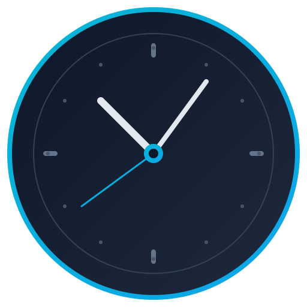
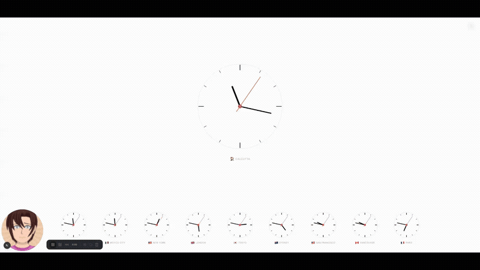

# eva.watch 

> A luxury web clock with beautiful skins, world clocks, and smooth animations. Set it as your homepage.

<p align="center">
  
</p>

## ✨ Features

- 🎨 **48 stunning clock skins** — 24 digital + 24 analog themes
- 🌍 **World clock support** — 50+ cities with drag-and-drop reordering
- ⌨️ **Keyboard shortcuts** — Power user friendly
- 📱 **PWA support** — Install as a native app
- 🔊 **Optional tick sound** — Authentic mechanical clock tick
- 🖥️ **Fullscreen mode** — With wake lock to prevent screen sleep
- 📦 **Embeddable widgets** — Add clocks to your website
- 🌓 **Reduced motion support** — Respects accessibility preferences

## 🚀 Quick Start

```bash
git clone https://github.com/superzero11/eva.watch.git
cd eva.watch
npm install
npm run dev
```

Open [http://localhost:3000](http://localhost:3000)

## ⌨️ Keyboard Shortcuts

| Key | Action |
|-----|--------|
| `/` | Search cities |
| `S` | Toggle settings drawer |
| `F` | Toggle fullscreen |
| `T` | Toggle digital/analog |
| `D` | Cycle seconds display |
| `Q` | Toggle tick sound |
| `G` | Toggle grid layout |
| `E` | Open embed widget modal |
| `←` `→` | Cycle through skins |
| `Escape` | Close modals |

## 🛠️ Tech Stack

- **Next.js 16** with Turbopack & React Compiler
- **React 19**
- **TypeScript** (strict mode)
- **Tailwind CSS v4**
- **Zustand** for state management
- **Framer Motion** for animations
- **@dnd-kit** for drag-and-drop

## 📦 Deployment

```bash
npm run build
npm run start
```

Or deploy to [Vercel](https://vercel.com) with one click:

[](https://vercel.com/new/clone?repository-url=https://github.com/superzero11/eva.watch)

## 🎨 Skins

**Digital skins:** Zen Minimal, OLED Night, Terminal Green, Swiss Railway, Aurora Glass, Cyber Neon, Paper Book, Monochrome Brutal, Retro LCD, Sunset Glow, Ocean Deep, Rose Gold, Matrix Rain, Midnight Purple, Coffee Shop, Arctic Ice, Spotify Dark, Red Ember, Lavender Dream, Forest Night, Warm Sand, Electric Blue, Newspaper, Synthwave

**Analog skins:** Classic Chrono, Minimal Bauhaus, Railway Dial, Skeleton Mechanical, Neon Ring, Soft Pastel, Dark Brass, Studio White, Submariner, Apple Watch, Pilot Navigator, Rose Gold Luxury, Ocean Blue, Vintage Cream, Carbon Fiber, Moonlight Silver, Forest Green, Tokyo Night, Desert Sand, Arctic Explorer, Burgundy Classic, Electric Purple, Mint Fresh, Copper Steampunk

## 🤝 Contributing

Contributions are welcome! Please read [CONTRIBUTING.md](CONTRIBUTING.md) first.

1. Fork the repository
2. Create your feature branch (`git checkout -b feature/amazing-feature`)
3. Commit your changes (`git commit -m 'Add amazing feature'`)
4. Push to the branch (`git push origin feature/amazing-feature`)
5. Open a Pull Request

## 📄 License

MIT — see [LICENSE](LICENSE) for details.

---

<p align="center">
  Made with ❤️ for people who appreciate beautiful clocks
</p>
